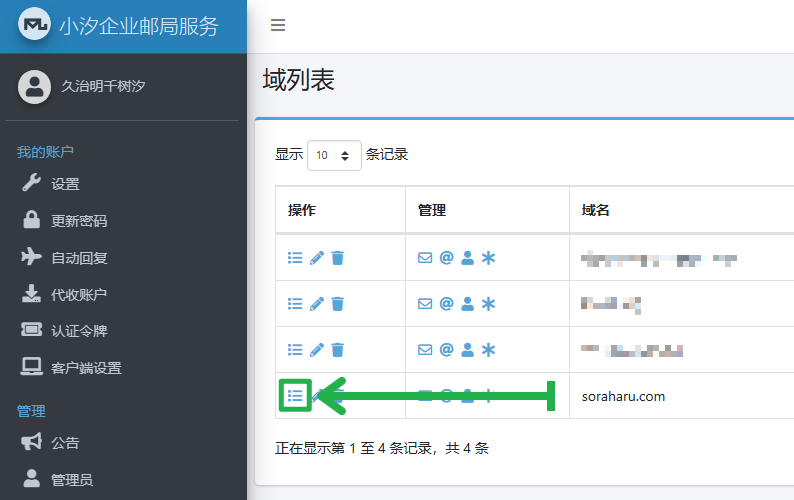

# 使用 Mailu + Podman 以分布式部署邮局服务的综合指南

　　Mailu 是一个伟大的开源项目，它提供了一整套完整的、开箱即用的服务容器，并使用 docker-compose 编排，使其对于大多数个人用户来说都没有任何部署门槛。

　　本指南标题中的「分布式部署」指将所有容器分离部署，允许通过网络的互联性，将可能部署在不同服务器上的容器有机结合在一起，形成完整的服务的部署方式。

　　本指南并不是使用 docker-compose 编排容器，并且也不是使用 Docker 或 K8s 作为基础运行环境，基于此，本指南并不适合对 Linux 和容器引擎完全不熟悉的人使用。在本指南中，我会尽可能地解释每一个操作背后的原理，希望能够在部署完成的同时，让读者对整个服务有一个清晰的认知，欢迎在阅读时随时提出问题和见解，适时 [评论](https://tech.soraharu.com/archives/147/) 或 [与我联系](mailto:admin@soraharu.com)。

> Warning
>
> 本指南使用的是 Mailu 官方所不支持的部署方式，使用此方式部署遇到的所有问题请直接与本指南作者沟通，**请不要在官方项目的任何地方提出关于此部署方式的任何疑问，这是在徒增开源项目维护者的工作负担**。请首先通过 [搜索引擎](https://www.google.com) 搜索定义类的问题以寻求解答，在遇到无法解决的问题的情况下，再尝试通过 [评论](https://tech.soraharu.com/archives/147/) 或 [邮件](mailto:admin@soraharu.com) 的形式与本指南作者 [交流讨论](https://github.com/ryanhanwu/How-To-Ask-Questions-The-Smart-Way/blob/main/README-zh_CN.md#%E5%9C%A8%E6%8F%90%E9%97%AE%E4%B9%8B%E5%89%8D)。

> Info
>
> 本指南的部署方式同样适用于由 [立创开发板团队](https://lckfb.com/) 发布的 [立创·泰山派开发板](https://lckfb.com/project/detail/lctspi-2g-16g)，但由于中国大陆地区的家庭互联网络一般无法使用 25 端口（并且完全无法解除该限制），所以必须使用外部 SMTP 中继服务，并且由于内存和存储空间的限制，你需要有一定的动手能力将泰山派开发板改造为最低 4GiB+32GiB 的配置，此部分的详细教程请等待后续发布。

　　按照作者本人的思维分析，本指南包含以下关键词：Podman、Mailu、CaddyServer、域名解析记录(A、AAAA、CNAME、TXT、SRV、SPF、MX、CAA)、邮件服务器安全(DMARC、DKIM、TLS、StartTLS)、邮件安全(PGP)、AlmaLinux(RHEL fork)、IP 与主机名、IPv6、子网。

## 前置准备

　　本指南推荐使用 AlmaLinux 8 或 AlmaLinux 9 作为主机操作系统，原则上来说，所有和 RHEL 8 & RHEL 9 兼容的 Linux 发行版都可以无缝跟随本指南的操作，当然，对其它操作系统熟悉的读者也可以选择自己心仪的操作系统，但在部分操作时，可能需要对命令进行修改，本指南不针对其它发行版提供针对性的命令。

　　因为涉及到域名邮局的搭建，需要读者持有至少一个拥有修改解析记录权限的域名。

　　为了部署 Mailu，需要读者拥有至少一个开放 25 端口、拥有公网 IP 地址、且支持 root 登录的服务器，该服务器还应该至少拥有 2GiB 运行内存。如果后续需要部署邮件杀毒服务，还需要额外的 1GiB 运行内存用于热载病毒库等数据，你可以使用 `free -h` 查看当前服务器的所有运行内存大小。

　　许多云服务器厂商在 TOS 中禁止了用户使用服务器对外发送电子邮件，它们通常会采用封禁 25 端口的形式来达成硬限制的目的。你首先应该查阅云服务器厂商的 TOS 确定其支持电子邮件外发，按照其流程解除所有针对于端口的限制后，使用 `telnet 1.2.3.4 25` 指令来测试端口是否是开放且未被占用的，该指令中的 `1.2.3.4` 为你服务器的公网 IP 地址。

　　建议在开始部署前，检测你的公网 IP 是否被列入黑名单，被列入黑名单的 IP 在发送电子邮件时很可能被自动移入垃圾邮件信箱中，你可以在 [这里](https://multirbl.valli.org/) 检查你的 IP 地址在各 IP 库中的状态。

## 安装前置运行环境

　　在跟随本指南配置 Mailu 服务之前，我们需要确保服务器内已安装有 Podman 运行环境，如果你是全新安装的 AlmaLinux 8 或 AlmaLinux 9，你可以使用 [我开发的初始化脚本](https://gitlab.soraharu.com/XiaoXi/Server-Automation-Scripts/) 便捷地部署本指南所需的运行环境：

**For AlmaLinux 8:**

```shell
wget -O ~/AlmaLinux8Podman.sh https://sh.soraharu.com/ServerMaintenance/FirstInstallation/AlmaLinux8Podman.sh && sh ~/AlmaLinux8Podman.sh "${sshPublicKey}" "${prettyHostname}" "${staticHostname}" && rm -f ~/AlmaLinux8Podman.sh
```

**For AlmaLinux 9:**

```shell
wget -O ~/AlmaLinux9Podman.sh https://sh.soraharu.com/ServerMaintenance/FirstInstallation/AlmaLinux9Podman.sh && sh ~/AlmaLinux9Podman.sh "${sshPublicKey}" "${prettyHostname}" "${staticHostname}" && rm -f ~/AlmaLinux9Podman.sh
```

> Info
>
> 请将上述命令中的 \${sshPublicKey} 替换成你的 SSH 公钥（允许留空），\${prettyHostname} 替换成你的主机名称，\${staticHostname} 替换成主机名称的友好格式（只包含小写字母、数字、下划线，且数字、下划线不能出现在开头与结尾）。如果提示 `wget` 命令不存在，请执行 `dnf install wget -y` 安装它。
>
> 本初始化脚本会修改 SSH 端口为 `51200`，启用 Cockpit 网页管理器并绑定端口 `51201`，你在下一次进行 SSH 连接时，应该正确地设置新的连接端口。

> Info
>
> 如果你是使用上述初始化脚本安装的环境，可以直接跳到 [下一个章节](#配置%20Mailu) 继续阅读。

　　如果你不想使用上述自动初始化脚本，也可以按照以下步骤配置运行环境：

**For AlmaLinux 8:**

```shell
# 更新系统版本
dnf clean all & dnf makecache & dnf update -y
# 安装依赖应用
dnf install -y glibc-common wget firewalld git podman netavark
# 启用 Podman 服务
systemctl enable --now podman.socket
# 启用防火墙服务
systemctl enable --now firewalld.service
```

**For AlmaLinux 9:**

```shell
# 更新系统版本
dnf clean all & dnf makecache & dnf update -y
# 安装依赖应用
dnf install -y glibc-common wget firewalld git podman
# 启用 Podman 服务
systemctl enable --now podman.socket
# 启用防火墙服务
systemctl enable --now firewalld.service
```

　　安装完依赖软件后，你需要配置一些参数，为了方便更改配置信息，我们首先需要关闭操作系统的 SELinux：

> Warning
>
> 关闭 SELinux 会削弱服务器的安全性，但一般情况下，及时更新操作系统、设置强口令、使用较为成熟的软件解决方案也可以降低服务器的漏洞风险，请自行取舍，如若不关闭 SELinux，需要自行解决后续可能会出现的沙盒权限问题。

```shell
setenforce 0 && sed -i 's/SELINUX=enforcing/SELINUX=disabled/g' /etc/selinux/config
```

　　接下来，需要在防火墙配置内开启相关服务端口：

```shell
# 仅 AlmaLinux 8 需要执行：在防火墙新建 http/3 服务的配置
firewall-cmd --permanent --new-service=http3 && firewall-cmd --permanent --service=http3 --add-port=443/udp

# 为 public 区域关联防火墙服务
firewall-cmd --permanent --zone=public --add-service=http --add-service=https --add-service=http3 --add-service=smtp --add-service=smtp-submission --add-service=smtps --add-service=imap --add-service=imaps --add-service=pop3 --add-service=pop3s && firewall-cmd --reload
```

> Info
>
> 此处使用的是 `--add-service` 而不是 `--add-port` 添加端口，作者认为这更加规范且符合 firewall 作者最初的设想，能够更加便于识别各端口所关联的服务功能。

　　如果你的服务器操作系统是 AlmaLinux 8，此时你需要将 Podman 的网络移交给 Netavark 管理，这是为了更好地支持 IPv4+IPv6 双栈连接，而 AlmaLinux 9 的 Podman 网络已内置对 IPv6 的支持，所以无需执行以下命令：

```shell
cp /usr/share/containers/containers.conf /etc/containers/containers.conf && sed -i 's/network_backend = "cni"/network_backend = "netavark"/g' /etc/containers/containers.conf && systemctl restart podman.socket
```

　　然后，为 Podman 新建一个包含 IPv6 的虚拟网络：

```shell
podman network create --ipv6 --gateway fd00::1:8:1 --subnet fd00::1:8:0/112 --gateway 10.90.0.1 --subnet 10.90.0.0/16 podman1
```

> Info
>
> 我们新建了一个 IPv4 子网为 `10.90.0.0/16`、IPv6 子网为 `fd00::1:8:0/112`、名称为 `podman1` 的虚拟网络。

　　Mailu 是一组很「重」的应用程序，在 [前置准备](#前置准备) 阶段，我推荐为 Mailu 预留至少 3GiB 的运行内存，拥有足够大的内存可以将所有服务所需要的数据全部缓存起来，减少内存交换，从而加快后续的访问速度。如果你的物理运行内存在 5GiB 以下，我强烈建议你使用 Swap 技术增加总可用内存上限，以防在突发访问量情况下的 OOM。你可以先查询当前服务器的内存情况，检查是否已配置 Swap：

```shell
free -h
```

　　它的返回值应该是类似这样的：

```
              total        used        free      shared  buff/cache   available
Mem:          3.0Gi       1.9Gi       307Mi        35Mi       783Mi       794Mi
Swap:         3.0Gi        29Mi       3.0Gi
```

　　Swap - total 代表你当前服务器配置的 Swap 的大小，如果 Swap + Mem 的大小小于 5GiB，则你应该使用以下命令创建一个额外的 Swap 空间：

```shell
wget -O ~/newSwap.sh https://sh.soraharu.com/ServerMaintenance/Swap/newSwap.sh && sh ~/newSwap.sh "2G" "/swapfile" && rm -f ~/newSwap.sh
```

> Info
>
> 该命令创建了一个 2GiB 的 Swap 文件，文件的路径为 `/swapfile`，你可以根据需要调整 Swap 分区的大小和文件路径。
>
> 创建 Swap 时并不能一味追求大的空间，因为 Swap 本质存在于你的硬盘上，众所周知，硬盘的读取和写入速度都远远不及物理内存，它只应当在物理内存不足时被适量使用。

　　很多云服务厂商在使用一个名为 Virtio-Balloon 的驱动从你的虚拟服务器中回收没有被明确占用的内存空间以分配给其它有需要的租户，我认为这是一种变相的超售行为，且会减慢服务器请求分配内存的响应速度，你可以使用以下命令移除该驱动：

```shell
rmmod virtio_balloon
```

　　好了！到这里，你已经完成了所有前置运行环境的安装与配置。

## 配置 Mailu

　　Mailu 官方提供了一个 [在线配置生成器](https://setup.mailu.io/)，你可以在这里便捷地配置你的 Mailu 安装。

　　本指南当前适配 `Mailu 2.0` 版本，因为作者我本人也在使用 Mailu 作为团队邮件基础设施，所以本指南也将同步跟进 Mailu 的最新稳定版本，如果你发现当前指南的版本落后于官方稳定版本，可以 [友好地向我催更](mailto:admin@soraharu.com)。

　　以下我将逐个讲解当前版本允许配置的参数以及我所推荐的参数值：

**Mailu storage path**

　　Mailu 所有文件的默认存储目录。跟随本指南的脚步，请将本参数配置为 `/podmandirectory/mailu`。

**Main mail domain and server display name**

　　主要邮件域与服务器显示名称。其实也就是你想要绑定在本邮件服务器上的第一个邮件域，如果你希望使用类似于 `postmaster@soraharu.com` 的邮件地址发送/接收邮件，那么本参数应该被配置为 `soraharu.com`。

**Postmaster local part**

　　邮局管理员名称。本参数将和上一个参数 (**Main mail domain and server display name**) 共同作用，如果你希望使用类似于 `postmaster@soraharu.com` 的邮件地址发送/接收邮件，那么本参数应该被配置为 `postmaster`。除此外，本参数和上一个参数所组合成的电子邮件地址将会作为本邮件服务器接收 DMARC 「rua」 与 「ruf」 报告的地址，简单来说，当一个其它邮件服务器开始将你发出的电子邮件标识为垃圾邮件时，你将会受到一封提示邮件。

**Choose how you wish to handle security TLS certificates**

　　选择获取 TLS 安全证书的方式。为了部署一个现代的安全电子邮件服务器，我们需要为服务器获取广受信任的安全证书。如果你有付费的安全证书，请选择 `cert` 或 `mail` 选项，并参照 [Finish setting up TLS](https://mailu.io/2.0/compose/setup.html#finish-setting-up-tls) 配置你的安全证书引用。一般用户请选择 `mail-letsencrypt` 选项。

> Info
>
> 此处有两个选项都是使用 Let's Encrypt 服务自动申请安全证书，我们选择 `mail-letsencrypt` 选项是因为我们不需要 Mailu 生成面向 HTTPS 前端访问的安全证书。在后续的配置阶段，我们会使用 CaddyServer 对我们的前端服务进行反向代理，并使用 CaddyServer 的 certbot 生成前端面向用户的安全证书。

**Authentication rate limit per IP for failed login attempts on unique non-existing accounts**

　　每个访问者 IP 在每个唯一的不存在的账户上失败登录的次数限制。此参数的名称非常拗口，但你可以简单地理解为针对于暴力破解的防护，应该设置为一个较小的值，比如 `5` 次每小时。

**Authentication rate limit per user**

　　每个用户的身份验证速率限制。每个用户每天能够尝试进行登录/身份验证的次数，采用默认的 `50` 就不错，不会过多增加暴力破解的风险，也不会影响正常用户的使用。如果你将会使用 POP3 协议在众多客户端上同时接受你的邮件（当然这应该是不可能的 :) ），你可以适当增大该参数的值。

**Outgoing message rate limit (per user)**

　　每个用户的出栈消息速率限制。可以简单地理解为每个用户每天最多能够发送多少封邮件，如果这个邮件服务器只是你个人使用，可以将其设置为一个较大的值，如果有其它人和你共同使用该邮件服务器，请使用本参数对发信速率作出限制，否则，过高的发信速率很容易导致邮件服务器绑定的 IP 地址欺诈分数提升，最终导致发出的电子邮件过多地进入垃圾邮箱内。

**Opt-in for anonymized statistics**

　　发送匿名统计信息。如果选中该选项，则你将定期发送匿名统计信息到 Mailu 官方服务器，跟随自己的偏好选择即可。

**Website name**

　　站点名称。在此处设置的站点名称会应用在 SSO 登录页、管理页的标题中，可以根据喜好修改，例如 `小汐个人邮局服务`。

**Linked Website URL**

　　站点 URL 链接。你访问网页管理界面、网页邮箱界面所使用的站点 URL，站点中的部分链接将会根据该参数进行拼接，可以填写例如 `https://mail.soraharu.com`。

**Enable the admin UI**

　　启用网页管理界面。你配置邮件域、中继、别名、管理账户等所有操作都需要在管理界面进行，请选中该选项以启用网页管理界面。

**Enable the API**

　　启用 API。API 接口遵循 RESTful API 规范，用于更改 Mailu 的配置，任何可以通过 Mailu 网页管理界面配置的内容都可以通过 RESTful API 进行配置，若要启用 API，必须配置 API 令牌，选中该选项后将会在选项下方出现 API 令牌。本指南并没有使用 API 的操作，你可以根据需要自行启用或禁用 API，开启 API 会减弱实例的安全性，你可以在后续需要的时候，在指定的 `mailu.env` 配置文件中启用它。

**Enable Web email client**

　　启用网页邮箱。网页邮箱是一个公开的电子邮箱客户端的 Web 界面，它使用 IMAP 和 SMTP 服务与 Mailu 基础设施建立连接以实现邮件的收发功能，公开该复杂的应用程序将会为你的邮件服务器带来更广的攻击面，会有更大的安全隐患。本指南推荐你启用 `roundcube` 作为网页邮箱，它拥有现代的交互界面与足够有能力的维护者（当前为 [Nextcloud 团队](https://roundcube.net/news/2023/11/30/nextcloud-the-new-home-for-roundcube)），但你仍然应该了解这其中的风险并自行判断是否启用它。

**Enable the antivirus service**

　　启用反病毒服务。启用该服务有助于对抗利用电子邮件进行初次感染的大规模病毒传播活动，你需要确保服务器最少拥有 3GiB 的运行内存供 ClamAV 热载它的签名数据库。本指南的后续步骤建立在你启用反病毒服务的前提下。

**Enable the webdav service**

　　启用 WebDAV 服务。启用该服务将允许你在邮件账号内存储通讯录和日历。本指南的后续步骤建立在你启用 WebDAV 的前提下。

**Enable fetchmail**

　　启用代收邮件服务。启用该服务后，你可以在网页管理界面配置基于 IMAP/POP3 协议的代收邮件功能，这样你就可以将你在 Gmail、Outlook 等邮件服务商上的邮件统一收取至你自己搭建的 Mailu 邮件服务器内管理，实现一站式邮件服务。本指南的后续步骤建立在你启用代收邮件服务的前提下。

**Enable oletools**

　　启用 oletools。oletools 扫描电子邮件附件中的文档以防止恶意宏攻击，它的内存占比很低，如无特殊情况请无条件启用它。

**IPv4 listen address**

　　监听的 IPv4 地址。邮件服务器必须向世界公开，才能接收、发送电子邮件，并允许用户访问其电子邮箱，这意味着你需要在此处指定一个绑定在你服务器上的公网 IPv4 地址。请不要尝试填写 `0.0.0.0` 或 `::` 等通用接口地址，这很有可能会导致网络路由异常或邮件服务器 IP 与声明 IP 不匹配（SPF 验证错误）。

**Subnet of the docker network**

　　Docker 子网。因为 Mailu 官方推荐使用 docker-compose 编排整个 Mailu 系统的运行，所以本参数名为 Docker 子网。我们使用的 Podman 与 Docker 十分类似，也是一个容器引擎，在 [安装前置运行环境](#安装前置运行环境) 章节，我们新建了 Podman 子网，它的子网网段为 `10.90.0.0/16`，请将它设置为本参数的值。

**Enable IPv6**

　　启用 IPv6。启用 IPv6 可以让你的邮件服务器获得更加优秀的外部连通性（比如可以与纯 IPv6 服务器建立连接并收发邮件，虽然可能没有服务器敢这么勇敢 :) ）。我们在前文中已经为 Podman 启用了 IPv6 支持，当这里暂时还是不建议启用 IPv6，关于 IPv6 最终配置的内容请等待后续的专题文章。

**Enable an internal DNS resolver (unbound)**

　　启用内部 DNS 解析程序。unbound 解析使 Mailu 能够进行 DNSSEC 验证、DNS 根查找和缓存，这有助于反垃圾邮件服务不被公共或 ISP 的 DNS 服务器阻止。本指南的后续步骤建立在你启用 unbound 的前提下。

**Public hostnames**

　　公共主机名称。你的服务器将在主要主机名下可用，但可能需要公开多个公共主机名。指向此服务器的每个电子邮件域的 MX 记录中都必须有一个列在此处的主机名。此处填写的主机名必须以英文逗号 `,` 分隔。如果你在访问网页管理界面时遇到问题，请确保你访问时所使用的主机名为此处的第一个条目。除此外，你还要确保此列表中的第一个条目解析为上文中 **IPv4 listen address** 的 IP 地址，这也应该是绑定在你的服务器的公网 IPv4 地址。为了尽可能降低部署的电子邮箱对外发信时的欺诈指数，你还应该将该公网 IPv4 地址的反向 DNS 条目（rDNS）解析为此处的第一个条目。参考的配置值为 `mail.soraharu.com`，如果你希望像大部分公共服务那样对 IMAP/POP3/SMTP 服务有着各自单独的主机名，请自行在后方新增。

> Info
>
> 虽然像大部分公共服务都针对 IMAP/POP3/SMTP 设置了单独的主机名，但我认为这是没有什么意义的行为，还会增加配置客户端时的心智负担，所以我推荐只保留主要主机名。

　　完成以上所有配置后，我们选择页面最底部的 「Setup Mailu」 按钮进入下一步。

　　等待页面加载完成后，定位到 「Step 1 - Download your configuration files」 模块，在 「Then download the project file. A side configuration file makes it easier to read and check the configuration variables generated by the wizard.」 下方有类似这样的内容：

```shell
cd /podmandirectory/mailu
wget https://setup.mailu.io/2.0/file/abcdedcb-1234-5678-9012-abcdefabcdef/docker-compose.yml
wget https://setup.mailu.io/2.0/file/abcdedcb-1234-5678-9012-abcdefabcdef/mailu.env
```

　　复制其中包含 `mailu.env` 的 URL，并将其下载下来，这就是存储刚才我们配置的参数的文件，现在使用本地的文本编辑器打开它，继续修改几个参数：

```
# 必须修改：真实 IP 标头，因为我们将会使用 CaddyServer 反向代理服务器，所以我们需要从 X-Real-IP 获取用户的真实 IP 地址
REAL_IP_HEADER=X-Real-IP

# 必须修改：可信的 IP 来源，是我们前文中设置的 Podman 网络的 CIDR
REAL_IP_FROM=10.90.0.0/16,fd00::1:8:0/112

# 推荐修改：将时区设置为 Asia/Shanghai，是标准的东八区时间
TZ=Asia/Shanghai

# 可修改：邮件体积限制（单位：byte），最大的附件大小比这个参数小 33%，默认为 50MB
MESSAGE_SIZE_LIMIT=50000000

# 可修改：新邮箱的欢迎邮件
WELCOME=true
WELCOME_SUBJECT=欢迎使用小汐企业邮局服务
WELCOME_BODY=欢迎使用小汐企业邮局服务，如果你阅读到了本邮件，代表你的电子邮件信箱已经配置成功！

# ===== 以下参数原文件中不存在，需要自行新建 =====

# 必须新建：以子网 IP 的形式索引各容器
ADMIN_ADDRESS=10.90.0.35
ANTISPAM_ADDRESS=10.90.0.39
ANTIVIRUS_ADDRESS=10.90.0.40
FRONT_ADDRESS=10.90.0.32
IMAP_ADDRESS=10.90.0.36
REDIS_ADDRESS=10.90.0.33
SMTP_ADDRESS=10.90.0.37
WEBDAV_ADDRESS=10.90.0.41
WEBMAIL_ADDRESS=10.90.0.43
RESOLVER_ADDRESS=10.90.0.34
OLETOOLS_ADDRESS=10.90.0.38
FETCHMAIL_ADDRESS=10.90.0.42

# 推荐新建：设置 SESSION 的安全性和有效期，这样可以减少要求登录的频率，但会降低一部分安全性
SESSION_COOKIE_SECURE=True
SESSION_TIMEOUT=108000
PERMANENT_SESSION_LIFETIME=31536000

# 推荐新建：为 Roundcube 指定安装的插件，可以优化网页邮箱的使用体验
ROUNDCUBE_PLUGINS=archive,carddav,emoticons,enigma,mailu,managesieve,markasjunk,newmail_notifier,zipdownload

# 可新建：配置 LOGO 与 LOGO 背景颜色
LOGO_BACKGROUND=
LOGO_URL=
```

　　请至少将所有标注为 **必须修改**、**必须新建** 的参数配置完成后保存该文件，一会儿我们将会用到它。

## 准备容器所使用的文件

　　如果你完全按照 [配置 Mailu](#配置%20Mailu) 中的推荐进行配置并成功修改了 `mailu.env` 文件，那么你需要部署的有 13 个容器，它们分别为：

- CaddyServer (caddy2)
- Mailu Nginx (mailu-front)
- Mailu Redis (mailu-redis)
- Mailu Unbound (mailu-resolver)
- Mailu Admin (mailu-admin)
- Mailu Dovecot (mailu-imap)
- Mailu Postfix (mailu-smtp)
- Mailu oletools (mailu-oletools)
- Mailu Rspamd (mailu-antispam)
- Mailu ClamAV (mailu-antivirus)
- Mailu Radicale (mailu-webdav)
- Mailu Fetchmail (mailu-fetchmail)
- Mailu Webmail (mailu-webmail)

　　在这个阶段，我们需要将容器所需要的所有文件和文件夹都创建到指定的位置，首先是创建所有所需的文件夹（你可以将它们保存到临时的 .sh 文件内再执行）：

```shell
# caddy2
mkdir -p /podmandirectory/caddy2/config/site/
mkdir -p /podmandirectory/caddy2/data/

# mailu-front
mkdir -p /podmandirectory/mailu/certs/
mkdir -p /podmandirectory/mailu/overrides/nginx/

# mailu-redis
mkdir -p /podmandirectory/mailu/redis/

# mailu-admin
mkdir -p /podmandirectory/mailu/data/
mkdir -p /podmandirectory/mailu/dkim/

# mailu-imap
mkdir -p /podmandirectory/mailu/mail/
mkdir -p /podmandirectory/mailu/overrides/dovecot/

# mailu-smtp
mkdir -p /podmandirectory/mailu/mailqueue/
mkdir -p /podmandirectory/mailu/overrides/postfix/

# filters 文件，因为过于庞大而且可以从外部服务器动态更新，所以放入 unbackup 目录，防止占用备份空间
mkdir -p /unbackupdirectory/mailu/filter/

# mailu-antispam
mkdir -p /podmandirectory/mailu/overrides/rspamd/

# mailu-webdav
mkdir -p /podmandirectory/mailu/dav/

# mailu-fetchmail
mkdir -p /podmandirectory/mailu/data/fetchmail/

# mailu-webmail
mkdir -p /podmandirectory/mailu/webmail/
mkdir -p /podmandirectory/mailu/overrides/roundcube/
```

　　然后，你需要将在 [配置 Mailu](#配置%20Mailu) 章节中获取到的 `mailu.env` 文件上传到服务器的 `/podmandirectory/mailu/` 文件夹，使其可访问路径为 `/podmandirectory/mailu/mailu.env`。

　　接下来，我们要为 CaddyServer 生成个性化的配置文件，这将会使用到我的 [Nice-Caddyfile](https://gitlab.soraharu.com/XiaoXi/Nice-Caddyfile) 开源项目中的代码，你可以访问代码仓库并自行决定是否采用它。如果你信任笔者，请跟随下方的操作：

　　编辑 Caddyfile 文件 (`vi /podmandirectory/caddy2/Caddyfile`)：

```caddyfile
{
	email letsencrypt@example.com
}

import /config/site/*.Caddyfile
```

> Info
>
> 请将以上内容中的 `letsencrypt@example.com` 替换为你的电子邮件地址，这个电子邮件地址用来接收来自 Let's Encrypt 的证书通知。

　　使用以下脚本自动配置 [Nice-Caddyfile](https://gitlab.soraharu.com/XiaoXi/Nice-Caddyfile) 项目：

```shell
wget -O ~/autoSyncNiceCaddyfile.sh https://sh.soraharu.com/Container/caddy2/autoSyncNiceCaddyfile.sh && sh ~/autoSyncNiceCaddyfile.sh "podman" "firstRun" && rm -f ~/autoSyncNiceCaddyfile.sh
```

　　最后，需要为你的站点域名（对应你在 [配置 Mailu](#配置%20Mailu) 章节的 「Linked Website URL」 参数）创建一个 Caddyfile 配置文件，该文件需要放置在 `/podmandirectory/caddy2/config/site/` 目录下，文件名类似于 `mail.soraharu.com.Caddyfile`，请将 `mail.soraharu.com` 替换为你的域名。该文件的内容如下：

```caddyfile
mail.soraharu.com {
	tls letsencrypt@example.com

	import /config/reuse/encode.Caddyfile
	import /config/reuse/header.secure-portal.Caddyfile

	reverse_proxy http://10.90.0.32:80 {
		import /config/reuse/header_up.follow.Caddyfile
	}
}
```

> Info
>
> 相同的，你需要将上述文件内容中的 `mail.soraharu.com` 替换为你的站点域名，`letsencrypt@example.com` 替换为你的电子邮件地址。

## 部署容器

　　容器部署的操作非常简单，没有什么技术难度，只需要将下述每一份代码粘贴到服务器的 bash 上执行即可：

### caddy2

```shell
podman container run\
    --cpu-shares=1024\
    --detach\
    --ip=10.90.0.2\
    --ip6=fd00::1:8:2\
    --label=io.containers.autoupdate=registry\
    --memory=1g\
    --memory-reservation=256m\
    --name=caddy2\
    --network=podman1\
    --publish=80:80/tcp\
    --publish=443:443/tcp\
    --publish=443:443/udp\
    --quiet\
    --replace\
    --restart=always\
    --tls-verify\
    --volume=/podmandirectory/caddy2/Caddyfile:/etc/caddy/Caddyfile\
    --volume=/podmandirectory/caddy2/config/:/config/\
    --volume=/podmandirectory/caddy2/data/:/data/\
    docker.io/library/caddy:2-alpine
```

### mailu-resolver

```shell
podman container run\
    --cpu-shares=1024\
    --detach\
    --env-file=/podmandirectory/mailu/mailu.env\
    --hostname=resolver\
    --ip=10.90.0.34\
    --ip6=fd00::1:8:34\
    --name=mailu-resolver\
    --network=podman1\
    --quiet\
    --replace\
    --restart=always\
    --tls-verify\
    ghcr.io/mailu/unbound:2.0
```

### mailu-front

```shell
podman container run\
    --cpu-shares=1024\
    --detach\
    --dns=10.90.0.34\
    --env-file=/podmandirectory/mailu/mailu.env\
    --hostname=front\
    --ip=10.90.0.32\
    --ip6=fd00::1:8:32\
    --log-driver=journald\
    --log-opt=tag=mailu-front\
    --name=mailu-front\
    --network=podman1\
    --publish=107.173.87.55:25:25/tcp\
    --publish=107.173.87.55:110:110/tcp\
    --publish=107.173.87.55:143:143/tcp\
    --publish=107.173.87.55:465:465/tcp\
    --publish=107.173.87.55:587:587/tcp\
    --publish=107.173.87.55:993:993/tcp\
    --publish=107.173.87.55:995:995/tcp\
    --quiet\
    --replace\
    --restart=always\
    --tls-verify\
    --volume=/podmandirectory/mailu/certs/:/certs/\
    --volume=/podmandirectory/mailu/overrides/nginx/:/overrides/:ro\
    ghcr.io/mailu/nginx:2.0
```

### mailu-redis

```shell
podman container run\
    --cpu-shares=1024\
    --detach\
    --dns=10.90.0.34\
    --hostname=redis\
    --ip=10.90.0.33\
    --ip6=fd00::1:8:33\
    --label=io.containers.autoupdate=registry\
    --name=mailu-redis\
    --network=podman1\
    --quiet\
    --replace\
    --restart=always\
    --tls-verify\
    --volume=/podmandirectory/mailu/redis/:/data/\
    docker.io/library/redis:alpine
```

### mailu-admin

```shell
podman container run\
    --cpu-shares=1024\
    --detach\
    --dns=10.90.0.34\
    --env=I_KNOW_MY_SETUP_DOESNT_FIT_REQUIREMENTS_AND_WONT_FILE_ISSUES_WITHOUT_PATCHES=1\
    --env-file=/podmandirectory/mailu/mailu.env\
    --hostname=admin\
    --ip=10.90.0.35\
    --ip6=fd00::1:8:35\
    --log-driver=journald\
    --log-opt=tag=mailu-admin\
    --name=mailu-admin\
    --network=podman1\
    --quiet\
    --replace\
    --restart=always\
    --tls-verify\
    --volume=/podmandirectory/mailu/data/:/data/\
    --volume=/podmandirectory/mailu/dkim/:/dkim/\
    ghcr.io/mailu/admin:2.0
```

> Info
>
> 此处有一个额外的环境变量名为 `I_KNOW_MY_SETUP_DOESNT_FIT_REQUIREMENTS_AND_WONT_FILE_ISSUES_WITHOUT_PATCHES`，是 Mailu 官方对于 **不使用** 官方推荐的部署方式部署程序的免责声明。

### mailu-imap

```shell
podman container run\
    --cpu-shares=1024\
    --detach\
    --dns=10.90.0.34\
    --env-file=/podmandirectory/mailu/mailu.env\
    --hostname=imap\
    --ip=10.90.0.36\
    --ip6=fd00::1:8:36\
    --log-driver=journald\
    --log-opt=tag=mailu-imap\
    --name=mailu-imap\
    --network=podman1\
    --quiet\
    --replace\
    --restart=always\
    --tls-verify\
    --volume=/podmandirectory/mailu/mail/:/mail/\
    --volume=/podmandirectory/mailu/overrides/dovecot/:/overrides/:ro\
    ghcr.io/mailu/dovecot:2.0
```

### mailu-smtp

```shell
podman container run\
    --cpu-shares=1024\
    --detach\
    --dns=10.90.0.34\
    --env-file=/podmandirectory/mailu/mailu.env\
    --hostname=smtp\
    --ip=10.90.0.37\
    --ip6=fd00::1:8:37\
    --log-driver=journald\
    --log-opt=tag=mailu-smtp\
    --name=mailu-smtp\
    --network=podman1\
    --quiet\
    --replace\
    --restart=always\
    --tls-verify\
    --volume=/podmandirectory/mailu/mailqueue/:/queue/\
    --volume=/podmandirectory/mailu/overrides/postfix/:/overrides/:ro\
    ghcr.io/mailu/postfix:2.0
```

### mailu-oletools

```shell
podman container run\
    --cpu-shares=1024\
    --detach\
    --dns=10.90.0.34\
    --hostname=oletools\
    --ip=10.90.0.38\
    --ip6=fd00::1:8:38\
    --name=mailu-oletools\
    --network=podman1\
    --quiet\
    --replace\
    --restart=always\
    --tls-verify\
    ghcr.io/mailu/oletools:2.0
```

### mailu-antivirus

```shell
podman container run\
    --cpu-shares=1024\
    --detach\
    --dns=10.90.0.34\
    --env-file=/podmandirectory/mailu/mailu.env\
    --hostname=antivirus\
    --ip=10.90.0.40\
    --ip6=fd00::1:8:40\
    --name=mailu-antivirus\
    --network=podman1\
    --quiet\
    --replace\
    --restart=always\
    --tls-verify\
    --volume=/unbackupdirectory/mailu/filter/:/data/\
    ghcr.io/mailu/clamav:2.0
```

### mailu-webdav

```shell
podman container run\
    --cpu-shares=1024\
    --detach\
    --dns=10.90.0.34\
    --hostname=webdav\
    --ip=10.90.0.41\
    --ip6=fd00::1:8:41\
    --name=mailu-webdav\
    --network=podman1\
    --quiet\
    --replace\
    --restart=always\
    --tls-verify\
    --volume=/podmandirectory/mailu/dav/:/data/\
    ghcr.io/mailu/radicale:2.0
```

### mailu-fetchmail

```shell
podman container run\
    --cpu-shares=1024\
    --detach\
    --dns=10.90.0.34\
    --env-file=/podmandirectory/mailu/mailu.env\
    --hostname=fetchmail\
    --ip=10.90.0.42\
    --ip6=fd00::1:8:42\
    --name=mailu-fetchmail\
    --network=podman1\
    --quiet\
    --replace\
    --restart=always\
    --tls-verify\
    --volume=/podmandirectory/mailu/data/fetchmail/:/data/\
    ghcr.io/mailu/fetchmail:2.0
```

### mailu-webmail

```shell
podman container run\
    --cpu-shares=1024\
    --detach\
    --dns=10.90.0.34\
    --env-file=/podmandirectory/mailu/mailu.env\
    --hostname=webmail\
    --ip=10.90.0.43\
    --ip6=fd00::1:8:43\
    --name=mailu-webmail\
    --network=podman1\
    --quiet\
    --replace\
    --restart=always\
    --tls-verify\
    --volume=/podmandirectory/mailu/webmail/:/data/\
    --volume=/podmandirectory/mailu/overrides/roundcube/:/overrides/:ro\
    ghcr.io/mailu/webmail:2.0
```

### mailu-antispam

```shell
podman container run\
    --cpu-shares=1024\
    --detach\
    --dns=10.90.0.34\
    --env-file=/podmandirectory/mailu/mailu.env\
    --hostname=antispam\
    --ip=10.90.0.39\
    --ip6=fd00::1:8:39\
    --log-driver=journald\
    --log-opt=tag=mailu-antispam\
    --name=mailu-antispam\
    --network=podman1\
    --quiet\
    --replace\
    --restart=always\
    --tls-verify\
    --volume=/unbackupdirectory/mailu/filter/:/var/lib/rspamd/\
    --volume=/podmandirectory/mailu/overrides/rspamd/:/overrides/:ro\
    ghcr.io/mailu/rspamd:2.0
```

### 验证

　　以上容器全部部署完成后，你需要使用 `podman ps` 查看容器的运行状态，如果在五分钟内（这个时间适用于大多数性能正常的服务器）所有的容器均没有异常终止，且健康检查状态都为 `healthy`，则代表所有容器均已正常运行，你可以进入下一章节查看如何让所有的容器开机自动启动且自动编排启动顺序。

## 使用 Systemd 接管容器

　　为了降低服务器运维难度，我为使用 Systemd 接管容器的操作也编写了自动运维脚本，请参照以下命令：

```shell
# caddy2
wget -O ~/newAutoUpdateContainer.sh https://sh.soraharu.com/ServerMaintenance/Podman/newAutoUpdateContainer.sh && sh ~/newAutoUpdateContainer.sh "caddy2" && rm -f ~/newAutoUpdateContainer.sh

# mailu-resolver
wget -O ~/newAutoUpdateContainer.sh https://sh.soraharu.com/ServerMaintenance/Podman/newAutoUpdateContainer.sh && sh ~/newAutoUpdateContainer.sh "mailu-resolver" && rm -f ~/newAutoUpdateContainer.sh

# mailu-front
wget -O ~/newAutoUpdateContainer.sh https://sh.soraharu.com/ServerMaintenance/Podman/newAutoUpdateContainer.sh && sh ~/newAutoUpdateContainer.sh "mailu-front" && rm -f ~/newAutoUpdateContainer.sh

# mailu-redis
wget -O ~/newAutoUpdateContainer.sh https://sh.soraharu.com/ServerMaintenance/Podman/newAutoUpdateContainer.sh && sh ~/newAutoUpdateContainer.sh "mailu-redis" && rm -f ~/newAutoUpdateContainer.sh

# mailu-admin
wget -O ~/newAutoUpdateContainer.sh https://sh.soraharu.com/ServerMaintenance/Podman/newAutoUpdateContainer.sh && sh ~/newAutoUpdateContainer.sh "mailu-admin" && rm -f ~/newAutoUpdateContainer.sh

# mailu-imap
wget -O ~/newAutoUpdateContainer.sh https://sh.soraharu.com/ServerMaintenance/Podman/newAutoUpdateContainer.sh && sh ~/newAutoUpdateContainer.sh "mailu-imap" && rm -f ~/newAutoUpdateContainer.sh

# mailu-smtp
wget -O ~/newAutoUpdateContainer.sh https://sh.soraharu.com/ServerMaintenance/Podman/newAutoUpdateContainer.sh && sh ~/newAutoUpdateContainer.sh "mailu-smtp" && rm -f ~/newAutoUpdateContainer.sh

# mailu-oletools
wget -O ~/newAutoUpdateContainer.sh https://sh.soraharu.com/ServerMaintenance/Podman/newAutoUpdateContainer.sh && sh ~/newAutoUpdateContainer.sh "mailu-oletools" && rm -f ~/newAutoUpdateContainer.sh

# mailu-antivirus
wget -O ~/newAutoUpdateContainer.sh https://sh.soraharu.com/ServerMaintenance/Podman/newAutoUpdateContainer.sh && sh ~/newAutoUpdateContainer.sh "mailu-antivirus" && rm -f ~/newAutoUpdateContainer.sh

# mailu-webdav
wget -O ~/newAutoUpdateContainer.sh https://sh.soraharu.com/ServerMaintenance/Podman/newAutoUpdateContainer.sh && sh ~/newAutoUpdateContainer.sh "mailu-webdav" && rm -f ~/newAutoUpdateContainer.sh

# mailu-fetchmail
wget -O ~/newAutoUpdateContainer.sh https://sh.soraharu.com/ServerMaintenance/Podman/newAutoUpdateContainer.sh && sh ~/newAutoUpdateContainer.sh "mailu-fetchmail" && rm -f ~/newAutoUpdateContainer.sh

# mailu-webmail
wget -O ~/newAutoUpdateContainer.sh https://sh.soraharu.com/ServerMaintenance/Podman/newAutoUpdateContainer.sh && sh ~/newAutoUpdateContainer.sh "mailu-webmail" && rm -f ~/newAutoUpdateContainer.sh

# mailu-antispam
wget -O ~/newAutoUpdateContainer.sh https://sh.soraharu.com/ServerMaintenance/Podman/newAutoUpdateContainer.sh && sh ~/newAutoUpdateContainer.sh "mailu-antispam" && rm -f ~/newAutoUpdateContainer.sh
```

　　以上方式为所有的容器都创建了默认的 Systemd 配置文件，接下来，我们还需要为它们编排启动的先后顺序，否则在下一次重启服务器时仍然可能出现错误：

```shell
# 编辑 mailu-front 容器的配置文件
vi /etc/systemd/system/container-mailu-front.service
```

```
# 在 [Unit] 模块的结尾添加以下内容：
After=container-mailu-resolver.service
Requires=container-mailu-resolver.service
```

```shell
# 编辑 mailu-redis 容器的配置文件
vi /etc/systemd/system/container-mailu-redis.service
```

```
# 在 [Unit] 模块的结尾添加以下内容：
After=container-mailu-resolver.service
Requires=container-mailu-resolver.service
```

```shell
# 编辑 mailu-admin 容器的配置文件
vi /etc/systemd/system/container-mailu-admin.service
```

```
# 在 [Unit] 模块的结尾添加以下内容：
After=container-mailu-redis.service container-mailu-resolver.service
Requires=container-mailu-redis.service container-mailu-resolver.service
```

```shell
# 编辑 mailu-imap 容器的配置文件
vi /etc/systemd/system/container-mailu-imap.service
```

```
# 在 [Unit] 模块的结尾添加以下内容：
After=container-mailu-front.service container-mailu-resolver.service
Requires=container-mailu-front.service container-mailu-resolver.service
```

```shell
# 编辑 mailu-smtp 容器的配置文件
vi /etc/systemd/system/container-mailu-smtp.service
```

```
# 在 [Unit] 模块的结尾添加以下内容：
After=container-mailu-front.service container-mailu-resolver.service
Requires=container-mailu-front.service container-mailu-resolver.service
```

```shell
# 编辑 mailu-oletools 容器的配置文件
vi /etc/systemd/system/container-mailu-oletools.service
```

```
# 在 [Unit] 模块的结尾添加以下内容：
After=container-mailu-resolver.service
Requires=container-mailu-resolver.service
```

```shell
# 编辑 mailu-antivirus 容器的配置文件
vi /etc/systemd/system/container-mailu-antivirus.service
```

```
# 在 [Unit] 模块的结尾添加以下内容：
After=container-mailu-resolver.service
Requires=container-mailu-resolver.service
```

```shell
# 编辑 mailu-fetchmail 容器的配置文件
vi /etc/systemd/system/container-mailu-fetchmail.service
```

```
# 在 [Unit] 模块的结尾添加以下内容：
After=container-mailu-admin.service container-mailu-smtp.service container-mailu-imap.service container-mailu-resolver.service
Requires=container-mailu-admin.service container-mailu-smtp.service container-mailu-imap.service container-mailu-resolver.service
```

```shell
# 编辑 mailu-webmail 容器的配置文件
vi /etc/systemd/system/container-mailu-webmail.service
```

```
# 在 [Unit] 模块的结尾添加以下内容：
After=container-mailu-front.service
Requires=container-mailu-front.service
```

```shell
# 编辑 mailu-antispam 容器的配置文件
vi /etc/systemd/system/container-mailu-antispam.service
```

```
# 在 [Unit] 模块的结尾添加以下内容：
After=container-mailu-front.service container-mailu-redis.service container-mailu-oletools.service container-mailu-antivirus.service container-mailu-resolver.service
Requires=container-mailu-front.service container-mailu-redis.service container-mailu-oletools.service container-mailu-antivirus.service container-mailu-resolver.service
```

　　以上修改了十个容器的配置文件，请确保你正确进行了每一个操作，之后执行 `systemctl daemon-reload` 重载配置。

## 使用网页管理界面配置 DNS 记录

　　在进入网页管理界面之前，你需要创建一个全局管理员账号：

```shell
podman exec mailu-admin flask mailu admin postmaster soraharu.com PASSWORD
```

> Info
>
> 以上创建全局管理员账号的命令中存在三个需要修改的变量，分别是：`postmaster` 管理员登录账号的前缀，建议和 「Postmaster local part」 参数保持一致；`soraharu.com` 管理员登录账号的邮件域，需要和 「Main mail domain and server display name」 参数保持一致，你的管理员登录账号将会由前缀和邮件域组合而成，最终类似于 `postmaster@soraharu.com`；`PASSWORD` 你的管理员登录密码。

　　接下来，请访问你配置在 「Linked Website URL」 的 URL 地址，如果一切顺利的话，你将会跳转到登录界面：


　　输入你在上文中设置的管理员登录账号与管理员登录密码，并选择 「登录 Admin」 选项，你将会进入到 Mailu 管理界面。对于全局管理员来说，左侧会有 「公告」、「管理员」、「中继域」、「反垃圾邮件」 四个专有菜单；域管理员和全局管理员都会拥有 「邮件域」 菜单；而普通用户只会拥有 「我的账户」 和 「转到」 下的菜单，不会拥有任何 「管理」 的内容。

　　了解完基本的菜单组成，请跳转到 「邮件域」 菜单，我们将要开始配置邮件域的 DNS 解析记录。首先查看你主要邮件域的详细信息：



　　你将会看到如下的许多条目，我将以我的邮件域的具体数据为例，讲解每一条 DNS 记录的配置含义，请你在配置的时候将以下所有条目中的特异值替换为你在自己的域 DNS 记录页面显示的值：


> Info
>
> 如果你是使用 Cloudflare 作为 DNS 服务提供商，请 **不要** 在任何条目开启代理。

**DNS MX 条目**

　　用于告知外阜发信服务器去哪里找到本邮件域的收信服务器的条目。

    - DNS 记录类型：MX
    - 名称：soraharu.com
    - 邮件服务器：mail.soraharu.com
    - TTL：600
    - 优先级：10

**DNS SPF 条目**

　　用于标识本邮件域允许的本阜发件服务器的地址，所有非本阜发出的、宣称为本邮件域发出的邮件都将被视为伪造邮件。

    - DNS 记录类型：TXT
    - 名称：soraharu.com
    - TTL：600
    - 内容：v=spf1 mx a:mail.soraharu.com ~all

> Info
>
> 在内容中，你除了可以使用 `a:mail.soraharu.com` 自动关联到域名解析的 IP 地址外，还可以使用 `ip4:1.2.3.4` 或 `ip6:1234:5678:90ab::1` 来直接指定 IP 地址，以上三个方式还可以重复出现，例如 `v=spf1 mx a:mail.soraharu.com ip4:1.2.3.4 ip6:1234:5678:90ab::1 ~all`。
>
> `~all` 代表软失败，你可以将其更改为 `-all` 硬失败，一旦更改，所有不是从指定 IP 地址发出的邮件都将被外阜收件服务器直接丢弃，而不是被标注为可疑邮件。

**DNS DKIM 条目**

　　DKIM 代表「域密钥识别邮件」。SPF 记录指示服务器是否可以代表你的邮件域，而 DKIM 记录会验证电子邮件本身。这是一个签名系统，可以让外阜收件服务器跟踪电子邮件的来源。DKIM 系统提供了一种方法来验证电子邮件是真实的、未经修改的并且是由您授权的服务器实际发送的。当 DKIM 检查失败时，外阜收件服务器会将电子邮件视为不可信，并由收件服务器自身的规则决定如何处理该电子邮件，它很可能最终会出现在收件人的垃圾邮件文件夹中，也可能被完全删除。

    - DNS 记录类型：TXT
    - 名称：dkim._domainkey.soraharu.com
    - TTL：600
    - 内容：v=DKIM1; k=rsa; p=MIIBIjANBgkqhkiG9w0BAQEFAAOCAQ8AMIIBCgKCAQEAw+gtu7zBaQtJqPfIBbtyGEWduYpHvWfo9pBx2slB1QAsOs4Tdro5mdru3eMHOCgHdPosRnN9J0LxACCGYFkZvW6rmThMf2+0cO4h10IgY4XWOolgVGQCTNtgCJstXETBv0IGd+2QgI9WRIjwJ/ODMO7zAzI/E5D9fm0Rtj/ur5CNkpsvKjMi8Fk4Tze724tMIaAlbFYNChmo3O45eR3kyOatCUH8lsLashsuZoj07oMH1p7NyDWcWN5wRiohxrUF0nKsw/2OQ3eyvCMp8m8vlcWqsr5kyv+tPgaZpXKgX2T/c0b/TqrH+so6Pw+FyLf8VNarrPRbYzvioRKKukgQwwIDAQAB

> Info
>
> 在 Mailu 的域 DNS 记录页面内，DNS DKIM 条目的内容被截断成两截，这是由于部分权威 DNS 服务商对 TXT 记录的长度作出了限制，但大部分服务商不存在这个限制，你可以简单地将所有内容合并为同一个字符串并设置单条 TXT 记录。

**DNS DMARC 条目**

　　DMARC 代表「基于域名的消息认证、报告与一致性机制」，是一个构建在 SPF 和 DKIM 技术之上的解决方案。DMARC 的核心思想是邮件的发送方通过特定方式 (SPF) 公开表明自己会用到的发件服务器、并对发出的邮件内容进行签名 (DKIM)，而邮件的接收方则检查收到的邮件是否来自发送方授权过的服务器、并且核对签名是否有效。对于未能通过前述检查项目的邮件，接收方则按照发送方指定的策略进行处理（比如直接投入垃圾箱或者拒收邮件），从而有效避免伪造的钓鱼邮件进入用户的收件箱。

    - DNS 记录类型：TXT
    - 名称：_dmarc.soraharu.com
    - TTL：600
    - 内容：v=DMARC1; p=reject; rua=mailto:postmaster@soraharu.com; ruf=mailto:postmaster@soraharu.com; adkim=s; aspf=s

    - DNS 记录类型：TXT
    - 名称：soraharu.com._report._dmarc.soraharu.com
    - TTL：600
    - 内容：v=DMARC1;

**DNS TLSA 条目**

　　TLS 身份验证 (TLSA) 记录用于将服务器的 X.509 证书或公钥值与包含该记录的域名相关联。只有在域上启用了 DNSSEC 时，才需要配置 TLSA 记录。

    - DNS 记录类型：TLSA
    - 名称：_25._tcp.mail.soraharu.com
    - 使用情况：2
    - 选择器：1
    - 匹配类型：1
    - 证书：0b9fa5a59eed715c26c1020c711b4f6ec42d58b0015e14337a39dad301c5afc3

**DNS 客户端 auto-configuration 条目**

　　客户端自动配置条目，顾名思义，是为了让支持的邮件客户端能够自动配置发信、收信服务器参数（服务器地址和端口）。本小结下的所有 SRV 记录是在 [RFC 6186](https://www.rfc-editor.org/rfc/rfc6186) 中定义的标准响应。

    - DNS 记录类型：SRV
    - 服务：_imap
    - 协议：_tcp
    - 名称：_imap._tcp.soraharu.com
    - 优先级：20
    - 权重：1
    - TTL：600
    - 端口：143
    - 目标：mail.soraharu.com

    - DNS 记录类型：SRV
    - 服务：_pop3
    - 协议：_tcp
    - 名称：_pop3._tcp.soraharu.com
    - 优先级：20
    - 权重：1
    - TTL：600
    - 端口：110
    - 目标：mail.soraharu.com

    - DNS 记录类型：SRV
    - 服务：_submission
    - 协议：_tcp
    - 名称：_submission._tcp.soraharu.com
    - 优先级：20
    - 权重：1
    - TTL：600
    - 端口：587
    - 目标：mail.soraharu.com

    - DNS 记录类型：SRV
    - 服务：_autodiscover
    - 协议：_tcp
    - 名称：_autodiscover._tcp.soraharu.com
    - 优先级：10
    - 权重：1
    - TTL：600
    - 端口：443
    - 目标：mail.soraharu.com

    - DNS 记录类型：SRV
    - 服务：_submissions
    - 协议：_tcp
    - 名称：_submissions._tcp.soraharu.com
    - 优先级：10
    - 权重：1
    - TTL：600
    - 端口：465
    - 目标：mail.soraharu.com

    - DNS 记录类型：SRV
    - 服务：_imaps
    - 协议：_tcp
    - 名称：_imaps._tcp.soraharu.com
    - 优先级：10
    - 权重：1
    - TTL：600
    - 端口：993
    - 目标：mail.soraharu.com

    - DNS 记录类型：SRV
    - 服务：_pop3s
    - 协议：_tcp
    - 名称：_pop3s._tcp.soraharu.com
    - 优先级：10
    - 权重：1
    - TTL：600
    - 端口：995
    - 目标：mail.soraharu.com

    - DNS 记录类型：CNAME
    - 名称：autoconfig.soraharu.com
    - 目标：mail.soraharu.com

> Info
>
> 该 CNAME 记录对应的 `autoconfig` 服务器还需要在 CaddyServer 内进行额外配置，你将在后续章节中了解到它。

　　到这一步，你的所有配置都已完成，请等待 DNS 记录同步到全球递归服务器（这可能最长需要 24 小时），然后你就可以享用你的完全自治电子邮件服务器啦！~

　　下一个章节，我将开始讲解各种优化、安全、高级功能配置技巧，你可以选择性地阅读以下任意章节，每一个章节都是一个完整的点。

## 在 CaddyServer 配置 autoconfig 服务器

　　在 [使用网页管理界面配置 DNS 记录](#使用网页管理界面配置%20DNS%20记录) 章节，我们为邮件域设置了一条 `autoconfig` 的 CNAME 记录，指向主要公共主机名称，这是为了兼容 [Mozilla Thunderbird 的自动配置协议](https://wiki.mozilla.org/Thunderbird:Autoconfiguration)，自动配置协议所需要的 xml 文件在我们的容器内已经存在了，但因为我们使用了 CaddyServer 对 Mailu 的前端进行了反向代理，所以单单配置 CNAME 记录不足以直接通过 `autoconfig` 子域名访问到指定 xml 文件，我们需要为所有的邮件域的 `autoconfig` 子域都配置 CaddyServer 反向代理。

　　单个反向代理配置文件如下，你应该为所有邮件域的 `autoconfig` 子域都创建如下配置文件，并放置于 `/podmandirectory/caddy2/config/site/` 目录下：

```caddyfile
# 文件名：autoconfig.soraharu.com.Caddyfile

autoconfig.soraharu.com {
	tls letsencrypt@example.com

	import /config/reuse/encode.Caddyfile
	import /config/reuse/header.secure-portal.Caddyfile

	reverse_proxy http://10.90.0.32:80 {
		import /config/reuse/header_up.follow.Caddyfile
	}

	@matchpath {
		not path /mail/config-v1.1.xml*
	}
	handle @matchpath {
		respond "This domain is only used for Autoconfiguration by Mozilla Thunderbrid and email clients that are compatible with its specifications." 403
	}
}
```

> Info
>
> 请将以上文件内容中的所有 `soraharu.com` 替换为你的邮件域，`letsencrypt@example.com` 替换为你的电子邮件地址。

　　文件创建完成后，你需要使用 `systemctl restart container-caddy2` 命令重启 CaddyServer 服务，然后访问 `https://autoconfig.soraharu.com/mail/config-v1.1.xml`（将 `soraharu.com` 替换为你的邮件域）测试是否能够访问，如果一切正常，你将会看到类似以下 xml 文件：

```xml
<clientConfig version="1.1">
    <emailProvider id="%EMAILDOMAIN%">
        <domain>%EMAILDOMAIN%</domain>
        <displayName>Email</displayName>
        <displayShortName>Email</displayShortName>
        <incomingServer type="imap">
            <hostname>mail.soraharu.com</hostname>
            <port>993</port>
            <socketType>SSL</socketType>
            <username>%EMAILADDRESS%</username>
            <authentication>password-cleartext</authentication>
        </incomingServer>
        <outgoingServer type="smtp">
            <hostname>mail.soraharu.com</hostname>
            <port>465</port>
            <socketType>SSL</socketType>
            <username>%EMAILADDRESS%</username>
            <authentication>password-cleartext</authentication>
            <addThisServer>true</addThisServer>
            <useGlobalPreferredServer>true</useGlobalPreferredServer>
        </outgoingServer>
        <documentation url="https://mail.soraharu.com/admin/client">
            <descr lang="en">Configure your email client</descr>
        </documentation>
    </emailProvider>
</clientConfig>
```

## 为域配置 DNSSEC 记录

　　编写中... [催更！](https://tech.soraharu.com/archives/147/)

## 在同一 VPC 的不同主机上拆分部署容器

　　编写中... [催更！](https://tech.soraharu.com/archives/147/)

## 部署第二邮件接收服务器

　　编写中... [催更！](https://tech.soraharu.com/archives/147/)

## 在泰山派上部署完整 Mailu 实例

　　编写中... [催更！](https://tech.soraharu.com/archives/147/)
